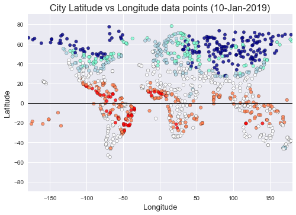
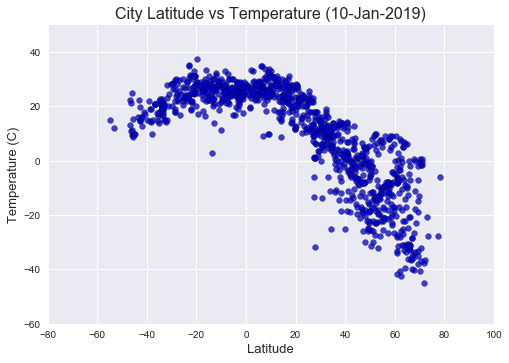
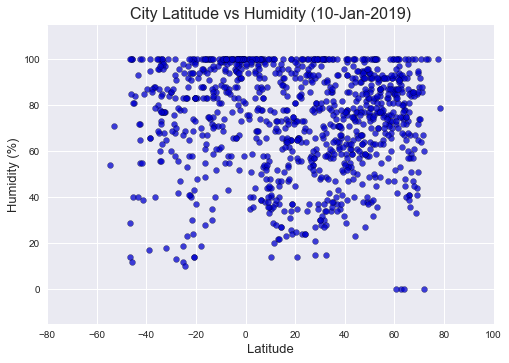
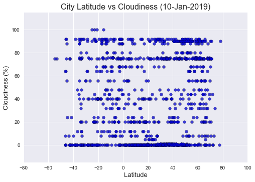
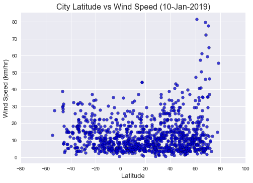

# Weather Data Analysis
What's the Weather Like?
---

Python script to visualize the weather of 500+ cities across the world of varying distance from the equator.

## Project

- Click here to see the Solution Code: [main.ipynb](main.ipynb)

- Click here to see the dataset generated: [weather_data.csv](output/weather_data.csv)

## Conclusions

- **The closest you are to the Equator the warmer the weather:** As we can see in the ScatterPlot "City Latitude vs Temperature", the closest you are to the equator the warmer the weather is. Also because we are on January, it is winter season (at least in the north part of the planet) the weather is significanlty colder.. having cities below -40 C.

- **No obvious relationship between Latitude vs Humidity or Latitude vs Cloudiness** It seems that there is no relationship between Latitude vs Humidity or Latitude vs Cloudiness. Humidity and Cloudiness can be affected by many variables like whether the city is close to the sea, if there is some meteorological event close to a city, or even some random weather conditions going on. 

- **Windy places seem to be in the North** There is no obvious relationship between Wind Speed and Latitude, however it seems that there are some cities in the North that have high wind speeds. This might or might not be related to the weather. It can also be related to special conditions on those places.

